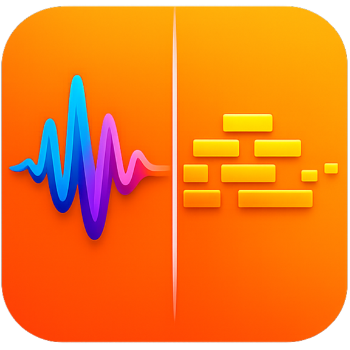
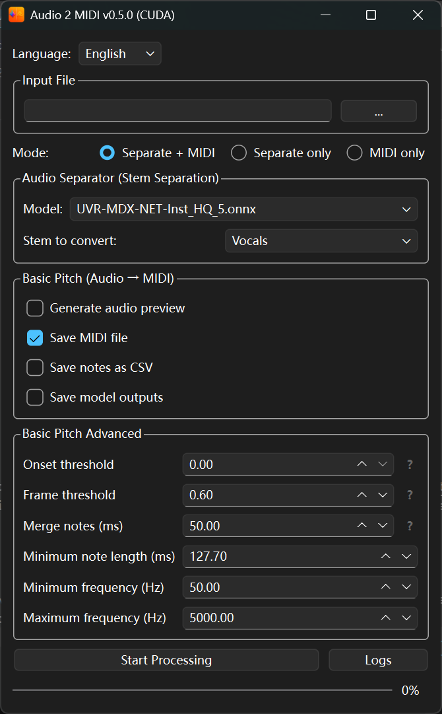

# Audio 2 MIDI

<p align="center">
  
</p>

<p align="center">
  <strong>English</strong> | <a href="README.zh-CN.md">简体中文</a> | <a href="README.ja.md">日本語</a>
</p>

Audio 2 MIDI is a Windows desktop application that combines Audio Separator and [Basic Pitch](https://github.com/spotify/basic-pitch) for stem separation, audio-to-MIDI transcription, note export to CSV, and MIDI audio previews. CPU, NVIDIA CUDA, and DirectML editions are included.

## ✨ Features

- 🎤 Separate vocals or instrumental stems.
- 🎹 Convert original audio or a separated stem to MIDI.
- 📥 Export MIDI, note CSV, Basic Pitch model output (NPZ), and MIDI preview audio (WAV).
- 🎛️ Tune onset/frame thresholds, minimum note length, frequency range, and note merging.
- 🔊 Open WAV, MP3, OGG, FLAC, and M4A files.
- 🌐 Use the interface in English, Simplified Chinese, or Japanese.
- 📊 Monitor progress, processing speed, and logs.

> 💡 **UVR-MDX-NET-Inst HQ 5** offers the best separation quality — recommended as the default choice.

<p align="center">
  
</p>

## 🚀 Choose an Edition

| Edition | Recommended hardware | Inference backend |
| --- | --- | --- |
| CPU | Systems without a suitable GPU; maximum compatibility | ONNX Runtime CPU |
| CUDA | NVIDIA GPU | CUDA 12.4 (cu124) |
| DirectML | AMD, Intel, or NVIDIA GPU, DX12 required | DirectML Execution Provider |

The CUDA edition requires an NVIDIA driver compatible with at least CUDA 12.4. The DirectML edition requires Windows 10/11, DirectX 12 support, and a current graphics driver. Even older Intel integrated graphics (tested with Intel UHD 620) can run via DirectML. Choose CPU if you are unsure.

## 📦 Download and Run

Regular users should download an application package from [GitHub Releases](../../releases/latest), not the automatically generated Source code archive.

1. Download the archive for your edition.
2. Extract the complete application directory. Do not copy only the EXE.
3. Run `Audio 2 MIDI (CPU).exe`, `Audio 2 MIDI (CUDA).exe`, or `Audio 2 MIDI (DirectML).exe`.

The first use of a separation model may require an internet connection. Downloaded models are stored under `models/audio-separator-models` beside the executable. The `UVR-MDX-NET-Inst_HQ_5.onnx` model is included by default.

## 🛠️ Run from Source

Requirements:

- 64-bit Windows 10 or Windows 11.
- Python ≤ 3.13.0 (the pre-built EXE is packaged with Python 3.10).
- Download FFmpeg full-shared from the [FFmpeg builds page](https://www.gyan.dev/ffmpeg/builds/) — it should contain 7 DLLs and 3 EXEs. Copy the `bin` folder into the edition directory you want to run or build (`cpu/`, `cuda/`, or `directml/`), and rename it to `ffmpeg`.
- An NVIDIA GPU and compatible driver for CUDA, or a DirectX 12 GPU for DirectML.

### Run from source

Choose one edition and create its environment inside that directory.

<details>
<summary>Using Python venv (click to expand)</summary>

Example for CPU:

```bat
cd cpu
py -3.10 -m venv .
Scripts\python.exe -m pip install --upgrade pip
Scripts\python.exe -m pip install -r requirements.txt
```

Start the application:

```bat
Scripts\python.exe main.py
```
</details>

Or using [uv](https://docs.astral.sh/uv/):

```bat
cd cpu
uv venv
uv pip install -r requirements.txt
uv run main.py
```

Follow the same process for `cuda` and `directml`, using the `requirements.txt` from that edition. Do not share one virtual environment between editions.

### Build manually

After setting up the environment and `ffmpeg` directory, run the build script:

```bat
build.bat
```

Outputs are written to:

```text
cpu/dist/Audio 2 MIDI (CPU)/
cuda/dist/Audio 2 MIDI (CUDA)/
directml/dist/Audio 2 MIDI (DirectML)/
```

## 📁 Repository Layout

```text
Audio-2-MIDI-GitHub/
|-- cpu/                 # CPU source, dependencies, and build files
|-- cuda/                # NVIDIA CUDA source, dependencies, and build files
|-- directml/            # DirectML source, dependencies, and build files
|-- .gitignore
|-- LICENSE              # Apache-2.0
|-- logo.png
|-- screenshot.png
|-- README.md            # English
|-- README.zh-CN.md      # Simplified Chinese
|-- README.ja.md         # Japanese
```

## ⚖️ Third-Party Software

This project uses Audio Separator, [Basic Pitch](https://github.com/spotify/basic-pitch), ONNX Runtime, PyTorch, PyQt6, and FFmpeg. Before redistribution, review the licenses and attribution requirements for every dependency, model, FFmpeg build, icon, and logo.

## 🐞 Reporting Issues

Include the edition, Windows version, CPU/GPU model, graphics driver version, application log, and reproduction steps. Do not upload private or copyrighted audio without permission.
